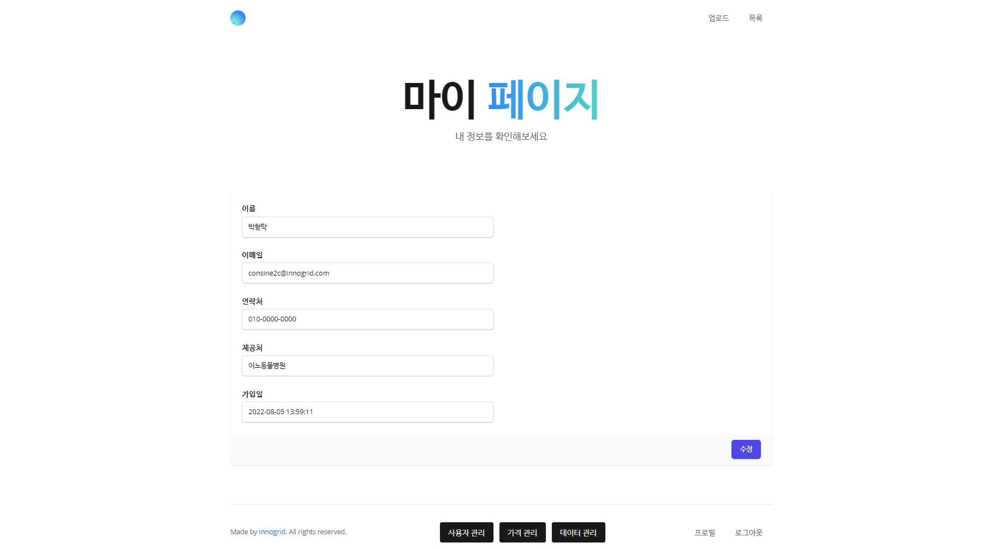
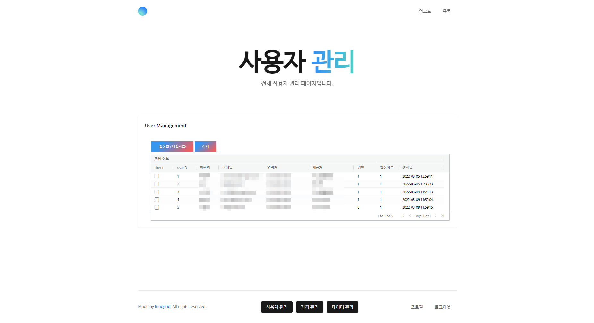
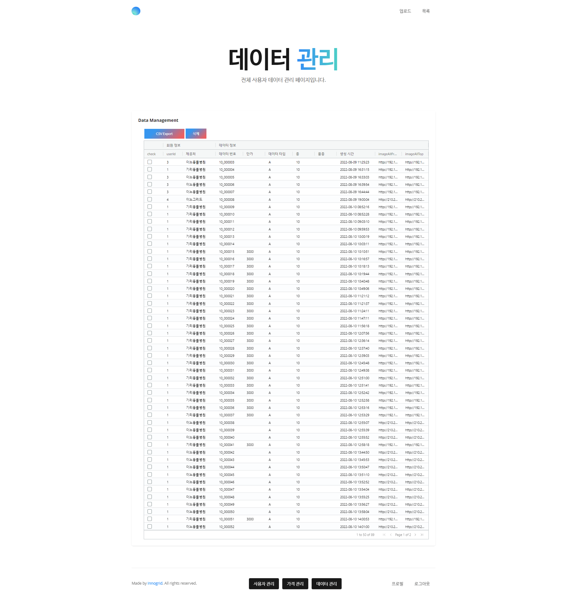

# animalinfo

- [데이터 수집 및 관리 도구 개발](https://github.com/taking/AnimalInfo) *(2022.07.28 ~ 2022.08.28)* - 오픈소스 프로젝트
    - Backend
        - 데이터베이스 및 API 설계
        - Node + Express.js 프레임워크 기반 RestAPI 서버 개발
        - 파일 메트릭에 따른 파일 처리 기능 개발
    - Frontend
        - React + Vitejs 기반 포탈 개발

## Screenshot

### Login Page

### Register Page

### Upload Page

### MyPage

### User Management Page

### Price Management Page

### Data Management Page

